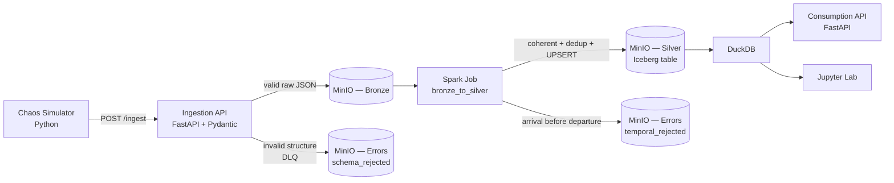

# 🚆 Railway Analytics Platform — Local Lakehouse

<!-- Replace <user>/<repo> with your GitHub path so the badge resolves. -->


A **multi-container** data engineering platform that simulates train operational
telemetry (inspired by **ÖBB**, the Austrian railway) and processes it in a
local **lakehouse**, end to end, with real business rules and **intentional
defect injection** to prove the pipeline's robustness.

> Chaos simulator → **Ingestion API** (FastAPI + Pydantic) → **MinIO/S3**
> (Bronze) → **Spark** hygienizes and UPSERTs into **Apache Iceberg** (Silver) →
> **DuckDB** queries at high speed → **Consumption API** (FastAPI).
> All orchestrated by **Docker Compose**.

---

## 📐 Architecture



| Layer | Where | Content |
|-------|-------|---------|
| **Bronze** | `s3://bronze/train_events/...` | Raw events accepted by the contract (1 JSON per event). |
| **Silver** | `s3://silver/warehouse/railway/train_events` | **Iceberg** table, hygienized, deduplicated and enriched. |
| **Gold (logical)** | Consumption API / Jupyter | KPIs and aggregations computed on demand by DuckDB. |
| **Errors (DLQ)** | `s3://errors/...` | `schema_rejected/` (Pydantic) and `temporal_rejected/` (Spark). |

Design details (`s3://` × `s3a://` schemes, copy-on-write, catalog choice, etc.)
are in [`docs/architecture.md`](docs/architecture.md).

---

## ✅ The three business rules

1. **Data contract at the gate.** An event without the mandatory identifiers
   (`trip_id`, `current_station_id`, `event_timestamp`) is blocked by Pydantic
   at ingestion and sent to the **Dead Letter Queue** at
   `errors/schema_rejected/...` (reason `SCHEMA_VALIDATION_FAILED`).

2. **Official delay rule.** The pipeline computes the difference between the
   scheduled and actual times. **Delay > 5 minutes ⇒ `DELAYED`**; otherwise
   `ON_TIME` (without enough data, `UNKNOWN`). The threshold is configurable via
   `DELAY_THRESHOLD_MIN`. This shields the refund statistics.

3. **Single-record guarantee.** Multiple updates of the same trip (same
   `trip_id`, same day) **produce no duplicates**: Spark deduplicates the batch
   and runs `MERGE INTO` by `trip_id` into the Iceberg table — updating the
   existing row or inserting a new one.

---

## 🌩️ Chaos engine (intentional defects)

The simulator injects two kinds of problem to prove that **errors stay
isolated** without crashing the pipeline:

| Chaos | What it does | Where it is caught |
|-------|--------------|--------------------|
| **Null Injection** | Erases `current_station_id` from some events | **Ingestion** (Pydantic) → `schema_rejected` |
| **Temporal Mess** | Inverts timestamps (arrival before departure) | **Spark** → `temporal_rejected` |

Temporal validation was **deliberately left in Spark** (and not in Pydantic), so
that inversions flow through to Bronze and are caught by the job's logic guard —
keeping **both gates** visible in the demo.

---

## 🧰 Stack

- **Python 3.12** — simulator, APIs, orchestrator
- **FastAPI + Pydantic v2** — ingestion (contract) and consumption
- **MinIO** — S3-compatible storage (Bronze / Silver / Errors)
- **Apache Spark 3.5.1** — hygienization and UPSERT (local standalone mode)
- **Apache Iceberg 1.6.1** — transactional table format (Silver layer)
- **DuckDB 1.1.3** — analytical querying directly over the Iceberg files
- **Jupyter Lab** — interactive exploration
- **Docker Compose** — orchestration of all containers

---

## 🗂️ Repository structure

```
railway-analytics-platform/
├── docker-compose.yml          # orchestrates the whole stack
├── .env.example                # environment variables (copy to .env)
├── Makefile                    # shortcuts: build, up, simulate, process, query...
├── requirements.txt            # HOST deps (simulator + orchestrator)
│
├── ingestion_api/              # Ingestion API (FastAPI + Pydantic)
│   ├── main.py                 #   routes /ingest, /health
│   ├── models.py               #   data contract (Pydantic)
│   ├── minio_client.py         #   Bronze / DLQ writes to MinIO
│   ├── config.py
│   ├── requirements.txt
│   └── Dockerfile
│
├── simulator/                  # Chaos simulator
│   ├── chaos_simulator.py      #   CLI: generates events + injects defects
│   ├── stations.py             #   25 real ÖBB stations
│   └── requirements.txt
│
├── spark/                      # Bronze → Silver processing
│   ├── jobs/bronze_to_silver.py#   hygienizes, dedup, MERGE INTO Iceberg
│   └── Dockerfile              #   Spark + Iceberg/S3A jars baked in
│
├── consumption_api/            # Consumption API (FastAPI + DuckDB)
│   ├── main.py                 #   /stats/*, /trips/*, /pipeline/status, /refresh
│   ├── duckdb_engine.py        #   DuckDB → Iceberg in MinIO
│   ├── config.py
│   ├── requirements.txt
│   └── Dockerfile
│
├── dashboard/                  # Streamlit UI (KPIs, charts, chaos generator)
│   ├── app.py
│   ├── requirements.txt
│   └── Dockerfile
│
├── orchestration/
│   ├── run_pipeline.py         # end-to-end orchestrator (host)
│   └── notebooks/
│       └── exploration.ipynb   # DuckDB queries over Iceberg
│
├── scripts/
│   └── wait_for_services.sh    # waits for the APIs to be healthy
│
├── tests/
│   └── test_ingestion_flow.py  # contract + DLQ tests (in-memory)
│
└── docs/
    └── architecture.md         # technical architecture document
```

---

## 📋 Prerequisites

- **Docker** and **Docker Compose v2** (`docker compose ...`).
- **Python 3.10+** on the host (only to run the simulator and the orchestrator).
- Internet access **on the first build** (the Spark image downloads 4 jars from
  Maven Central; the base images are pulled from the registries).

> Suggested Docker resources: ~4 GB of RAM and 2 CPUs.

---

## 🚀 How to run (step by step)

```bash
# 1. Configuration
cp .env.example .env

# 2. (host) environment for the simulator/orchestrator
python -m venv .venv && source .venv/bin/activate
pip install -r requirements.txt

# 3. Build the images (the Spark one downloads the jars — may take a while the 1st time)
make build

# 4. Bring up the stack (MinIO, Spark master/worker, APIs, Jupyter)
#    The bronze/silver/errors buckets are created automatically.
make up

# 5. (optional) wait for the APIs to be up
./scripts/wait_for_services.sh

# 6. Generate events with chaos injection (writes Bronze + DLQ)
make simulate

# 7. Process Bronze → Silver/Iceberg on Spark (hygienize, dedup, UPSERT)
make process

# 8. Query the punctuality KPIs (DuckDB over Iceberg)
make query
```

Or, after `make up`, run **everything at once**:

```bash
make pipeline          # simulate + process + query
# parameters: make pipeline TRIPS=300 DELAYED_RATE=0.4
```

Quick access after `make up`:

| Service | URL | Credentials |
|---------|-----|-------------|
| **Dashboard (Streamlit)** | http://localhost:8501 | — |
| MinIO Console | http://localhost:9001 | `minioadmin` / `minioadmin` |
| Ingestion API | http://localhost:8000/docs | — |
| Consumption API | http://localhost:8001/docs | — |
| Spark Master UI | http://localhost:8080 | — |
| Jupyter Lab | http://localhost:8888 | token `railway` |

---

## 🔍 Verifying each business rule

**1. Contract / DLQ (Null Injection).** Open the MinIO console
(http://localhost:9001) → bucket **`errors`** → folder
`schema_rejected/ingest_date=.../reason=SCHEMA_VALIDATION_FAILED/`. The events
without `current_station_id` are there — and Bronze stays intact.

**2. Temporal guard (Temporal Mess).** Still in the **`errors`** bucket, look at
`temporal_rejected/` — events with arrival before departure, caught by Spark,
with `reason_code = TEMPORAL_LOGIC_VIOLATION`.

**3. Delay rule.** The KPIs from `make query` (or `GET /stats/punctuality`) bring
`delayed_trips`, `on_time_trips`, `on_time_pct` and the average/maximum delay,
applying the 5-minute threshold.

**4. Single record (UPSERT).** Take any `trip_id` and query
`GET /trips/{trip_id}` — it appears **exactly once**, with the most recent state,
even after receiving several updates. (The notebook has the same proof.)

---

## 🌐 Endpoints

### Consumption API (port 8001)

| Method | Route | Description |
|--------|-------|-------------|
| `GET` | `/health` | Service status |
| `GET` | `/pipeline/status` | Health board: raw events in Bronze, rows in Silver, latest snapshot, rejects per DLQ. Never errors — reports zero when empty |
| `GET` | `/stats/punctuality` | KPIs: total, delayed, on time, % on time, average/max delay |
| `GET` | `/trips/delayed?min_delay=&limit=` | Delayed trips (filter by minimum delay) |
| `GET` | `/stats/by-station` | Aggregations per station |
| `GET` | `/stats/by-operator` | Aggregations per operator |
| `GET` | `/stats/delay-distribution` | Histogram of trips by delay band (0-5, 5-15, 15-30, 30+) |
| `GET` | `/trips/{trip_id}` | State of a trip (proves the UPSERT) |
| `POST` | `/refresh` | Reloads the DuckDB view onto the most recent Iceberg metadata |

> Run `make process` (or `POST /refresh`) whenever you reprocess, so DuckDB sees
> the new *snapshot*.

### Ingestion API (port 8000)

| Method | Route | Description |
|--------|-------|-------------|
| `GET` | `/health` | Service status |
| `POST` | `/ingest` | Accepts 1 event or a list; validates the contract and routes Bronze/DLQ. Responds `200` with `{received, accepted, rejected}` |

---

## 📊 Dashboard (Streamlit)

A friendly UI over the two APIs, at **http://localhost:8501**. It shows the
pipeline status board (Bronze / Silver / DLQ counts), the punctuality KPIs, a
**delay-distribution histogram** and average delay by station, plus a table of
the worst delays.

It also has a **chaos generator** in the sidebar, with plain-language controls
(percentage of faulty events, etc. — each with a tooltip): set the trip count
and defect rates, click *Send events*, and watch the accept/reject scoreboard —
the validation gate, live. After sending, run `make process` and click *Refresh
data* to see the new trips flow into the analytics.

## 📓 Exploration notebook

Open Jupyter (http://localhost:8888, token `railway`) and run
`work/exploration.ipynb`. It connects DuckDB to Iceberg in MinIO, locates the
most recent metadata and reproduces the KPIs, the worst delays, a chart of delay
per operator, and the proof of the UPSERT.

## ✅ Continuous integration

A GitHub Actions workflow (`.github/workflows/ci.yml`) runs on every push and
pull request: it executes the test suite, byte-compiles all Python, and
validates `docker-compose.yml`. Update the badge path at the top of this file
with your `<user>/<repo>` so it resolves.

---

## ⚙️ Configuration (`.env`)

| Variable | Default | Description |
|----------|---------|-------------|
| `MINIO_ROOT_USER` / `MINIO_ROOT_PASSWORD` | `minioadmin` | MinIO/S3 credentials |
| `S3_REGION` | `us-east-1` | Region (formal, required by the SDK) |
| `BRONZE_BUCKET` / `SILVER_BUCKET` / `ERRORS_BUCKET` | `bronze` / `silver` / `errors` | Layer buckets |
| `ICEBERG_NAMESPACE` / `ICEBERG_TABLE` | `railway` / `train_events` | Iceberg table identity |
| `DELAY_THRESHOLD_MIN` | `5` | Delay threshold (minutes) for `DELAYED` |
| `SPARK_WORKER_MEMORY` / `SPARK_WORKER_CORES` | `2G` / `2` | Worker resources |
| `JUPYTER_TOKEN` | `railway` | Jupyter access token |

---

## 🛠️ Makefile commands

| Command | What it does |
|---------|--------------|
| `make build` | Build the Docker images |
| `make up` | Bring up the stack (creates buckets automatically) |
| `make down` | Tear down the stack (keeps data) |
| `make ps` / `make logs` | Container status / logs |
| `make simulate` | Generate events with chaos (host) |
| `make process` | Run the Spark job (Bronze → Silver) |
| `make query` | Print the punctuality KPIs |
| `make pipeline` | `simulate` + `process` + `query` |
| `make clean` | Tear down **and delete the volumes** (wipes data) |

---

## 🧯 Troubleshooting

- **`bitnami/spark:3.5.1: not found` during `make build`** → as of Aug 2025
  Bitnami moved its Docker Hub images to the `bitnamilegacy/` namespace. The
  Spark Dockerfile already pins `bitnamilegacy/spark:3.5.1`; if even that tag is
  gone someday, change the `FROM` line in `spark/Dockerfile` to
  `bitnamilegacy/spark:3.5` or migrate to a maintained base (`apache/spark`).
- **The 1st `make build` fails downloading jars/images** → it is the network.
  Check internet access and run it again (the build is layer-cached).
- **`make process` complains about connecting to Spark** → check `make ps`; the
  `spark-master` must be *Up*. See the logs with `make logs`.
- **Consumption API responds `503`** → the table does not exist yet. Run
  `make simulate` and `make process` at least once; then `POST /refresh`.
- **`make simulate` fails with a connection error** → the ingestion API has not
  come up yet. Run `./scripts/wait_for_services.sh` first.
- **DuckDB does not find the table after reprocessing** → call `POST /refresh`
  (or `make query`, which already does it) to point at the newest metadata.

---

## 🔬 Validation status (transparency)

The **Python business logic was validated by real execution** in an isolated
environment: the Pydantic contract (accept/reject), the delay rule (5-minute
threshold, including the boundary case), deduplication/UPSERT (latest wins) and
the temporal guard — plus the ingestion integration tests with an in-memory S3
(`tests/test_ingestion_flow.py`) and the simulator's generation.

The **full container stack** (Spark + Iceberg + MinIO + DuckDB end to end) **was
not executed in that isolated environment** — Docker and access to Maven
Central/image registries were unavailable. The integration was assembled
carefully (`s3://`/`s3a://` schemes, copy-on-write, metadata discovery), but the
end-to-end validation should be done by you with:

```bash
make build && make up && make pipeline
```

If anything differs in your environment, the logs (`make logs`) and the MinIO
console are the best starting points.

---

## 🏭 Production notes

- Swap the **Hadoop** catalog for a transactional catalog
  (**REST / Nessie / Glue**) to support multiple writers with atomic commits.
- Use real, segregated credentials (no `minioadmin`); manage secrets outside
  `.env`.
- Reassess DuckDB's local convenience (`unsafe_enable_version_guessing`).
- Size Spark (memory/cores/executors) according to the real volume.

---

## 📄 License

Distributed under the **MIT** license. See [`LICENSE`](LICENSE).
