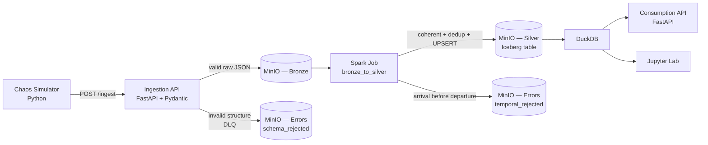

# Architecture — Railway Analytics Platform

Technical reference document. For the step-by-step run instructions, see the
[`README.md`](../README.md).

## 1. Overview

A local lakehouse that simulates train operational telemetry (inspired by the
Austrian ÖBB) and processes it in *medallion*-style layers:

The layers:

| Layer | Where | Content |
|-------|-------|---------|
| **Bronze** | `s3://bronze/train_events/...` | Raw events accepted by the contract (1 JSON per event), partitioned by `ingest_date` and `trip_id`. |
| **Silver** | `s3://silver/warehouse/railway/train_events` | Iceberg table, hygienized, deduplicated and enriched (delay rule). One row per trip. |
| **Gold (logical)** | served by the consumption API / Jupyter | Aggregations and KPIs computed on demand by DuckDB. Not materialized. |
| **Errors (DLQ)** | `s3://errors/...` | `schema_rejected/` (Pydantic gate) and `temporal_rejected/` (Spark gate). |

## 2. Two-layer defense (central design decision)

Validations are split into two gates with distinct responsibilities. This keeps
each layer cheap and makes **both mechanisms visible** in the demo.

### Gate 1 — Contract at the gate (Ingestion API, Pydantic)

- Validates **only structure and mandatory identifiers**: `trip_id`,
  `current_station_id`, `event_timestamp` present and non-empty.
- It is *stateless* and cheap: it queries nothing, compares no timestamps.
- An event without an identifier (e.g. `current_station_id = null`, injected by
  the chaos engine) is **rejected here** and goes to `errors/schema_rejected/...`
  with reason `SCHEMA_VALIDATION_FAILED`. The rejection is **not** an HTTP error:
  the API responds `200` with a scoreboard `{received, accepted, rejected}`.

### Gate 2 — Temporal logic guard (Spark)

- Temporal validation was **deliberately removed from Pydantic** so that
  timestamp inversions flow through to Bronze and are caught by Spark — that way
  both gates are demonstrable.
- The job separates incoherent events (**actual arrival before departure**, or
  the scheduled equivalent) and writes them to `errors/temporal_rejected/...`
  with reason `TEMPORAL_LOGIC_VIOLATION`, **without crashing the job**. The rest
  proceeds to the Iceberg table.

> Why split it this way? The gate protects against structural junk at minimal
> cost; the business logic (which requires comparing fields and understanding
> semantics) lives in the processing engine, where there is already context to
> handle it in batch.

## 3. The three business rules

1. **Data contract at the gate** — missing mandatory identifiers ⇒ block at
   Gate 1 ⇒ DLQ. (Chaos 1: *Null Injection*.)
2. **Official delay rule** — `delay_minutes = (actual_arrival − scheduled_arrival)/60`
   (with a *fallback* to departure when arrival is missing). `delay_minutes > 5`
   ⇒ `DELAYED`; otherwise `ON_TIME`; without enough data ⇒ `UNKNOWN`. The
   threshold is configurable (`DELAY_THRESHOLD_MIN`). It shields the refund
   statistics.
3. **Single-record guarantee** — multiple updates of the same trip (same
   `trip_id`) **do not duplicate**: Spark deduplicates the batch and runs
   `MERGE INTO` by `trip_id`, updating the existing row or inserting a new one.

## 4. Chaos engine (intentional defects)

| Chaos | What it does | Where it is caught |
|-------|--------------|--------------------|
| **Null Injection** | Erases `current_station_id` from some events | Gate 1 (Pydantic) → `schema_rejected` |
| **Temporal Mess** | Swaps `actual_departure`/`actual_arrival` (arrival before departure) | Gate 2 (Spark) → `temporal_rejected` |

The goal is to prove that **errors stay isolated in the rejected folder** and
that neither ingestion nor Spark break in the face of dirty data.

## 5. Integration decisions that usually break (and how we solved them)

### 5.1 `s3://` vs `s3a://` — the detail that lets DuckDB see Iceberg

- **Spark/Hadoop** reads the raw Bronze via **`s3a://`** (`S3AFileSystem`).
- **DuckDB** speaks **`s3://`** — it does not understand `s3a://`.
- If Iceberg writes the metadata paths as `s3a://`, DuckDB **cannot** read the
  table.

**Solution:** the Iceberg catalog uses **`S3FileIO`** with
`warehouse = s3://silver/warehouse` (`io-impl = org.apache.iceberg.aws.s3.S3FileIO`).
That way the metadata is written with **`s3://`** paths, read natively by
DuckDB. The two schemes coexist in the **same** `SparkSession`, each with its own
MinIO endpoint configuration.

### 5.2 Copy-on-write

The table is created with `write.update.mode`, `write.merge.mode` and
`write.delete.mode` = **`copy-on-write`**. The MERGE rewrites complete data
files instead of generating *delete files*. Result: DuckDB's `iceberg_scan`
reads intact Parquet files, regardless of *merge-on-read* support.

### 5.3 Hadoop catalog (self-contained)

We use a **`hadoop`**-type catalog (metadata in the bucket itself): simple and
with no extra service. For **production with multiple writers**, swap it for a
transactional catalog (**REST / Nessie / Glue**) — the Hadoop catalog offers no
atomic *commits* across concurrent writers.

### 5.4 Metadata discovery on consumption

The consumption API (and the notebook) list
`warehouse/railway/train_events/metadata/` in MinIO, extract the version with
the pattern `v?(\d+)\.metadata\.json` and use the **highest** number as the
current *snapshot*. The `/refresh` endpoint recreates the DuckDB view pointing at
the newest metadata after a new processing run.

## 6. UPSERT flow in Spark

1. **Read** Bronze (`s3a://bronze/train_events/*/*/*.json`) with an explicit
   schema (no inference).
2. **Temporal guard**: separates coherent × incoherent (the latter go to the DLQ).
3. **Delay rule**: computes `delay_minutes`, `is_delayed`, `delay_status`.
4. **Batch deduplication**: `row_number()` per `trip_id` ordered by
   `event_timestamp desc`, keep 1 (the most recent).
5. **MERGE INTO** the Iceberg table `ON trip_id`
   (`WHEN MATCHED UPDATE` / `WHEN NOT MATCHED INSERT`).

The analytical key is `trip_id` (one row per trip in the history, latest wins).
The table is partitioned by `trip_date`.

## 7. Ports and services

| Service | Port | Note |
|---------|------|------|
| MinIO API | 9000 | S3 compatible |
| MinIO Console | 9001 | `minioadmin` / `minioadmin` |
| Ingestion API | 8000 | `/docs`, `/ingest`, `/health` |
| Consumption API | 8001 | `/docs`, `/stats/*`, `/trips/*`, `/refresh` |
| Spark Master | 8080 (UI), 7077 (RPC) | standalone mode |
| Spark Worker | 8081 (UI) | points at the master |
| Jupyter Lab | 8888 | token `railway` |

## 8. Known limits

- **Hadoop catalog**: do not use with multiple concurrent writers in production
  (no distributed atomic commit).
- **Spark in local/standalone mode** in a single container: sized for a demo,
  not for production volume.
- **Default credentials** (`minioadmin`): change them outside a local
  environment.
- **`unsafe_enable_version_guessing` / `allow_moved_paths`** in DuckDB are
  conveniences for the local environment; reassess them in production.
